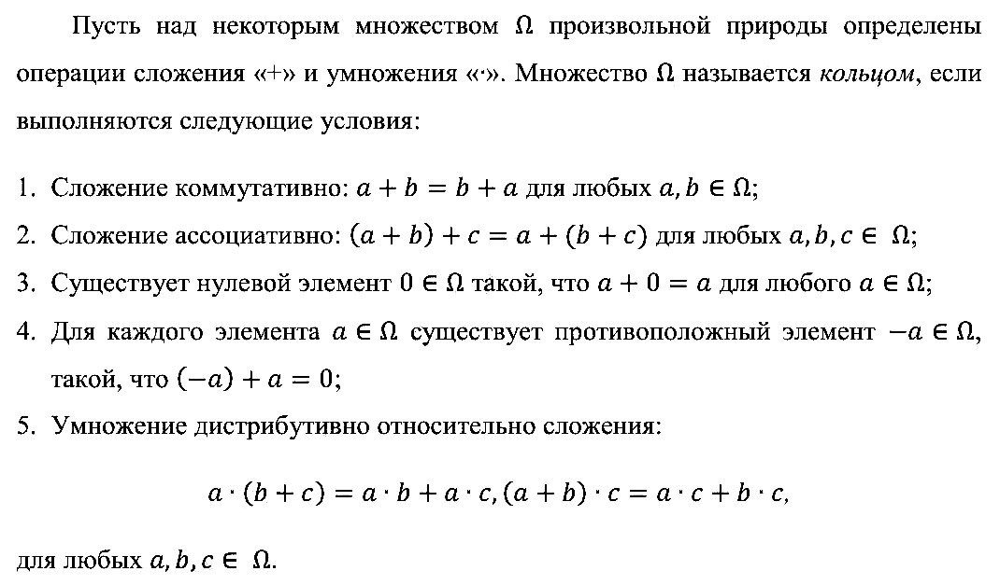
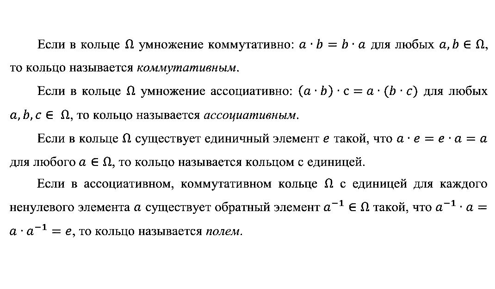
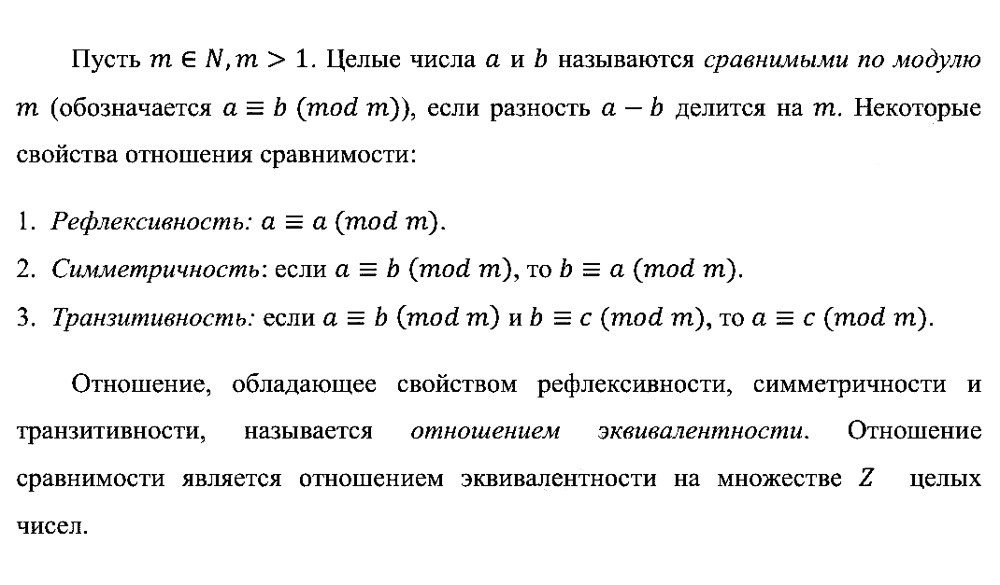
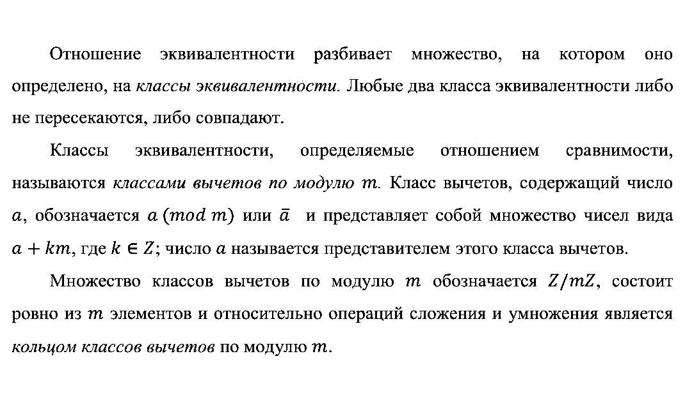
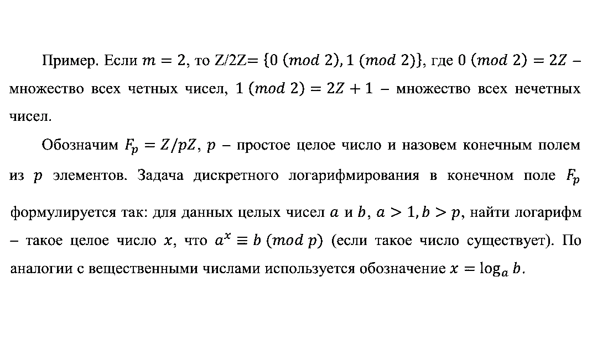
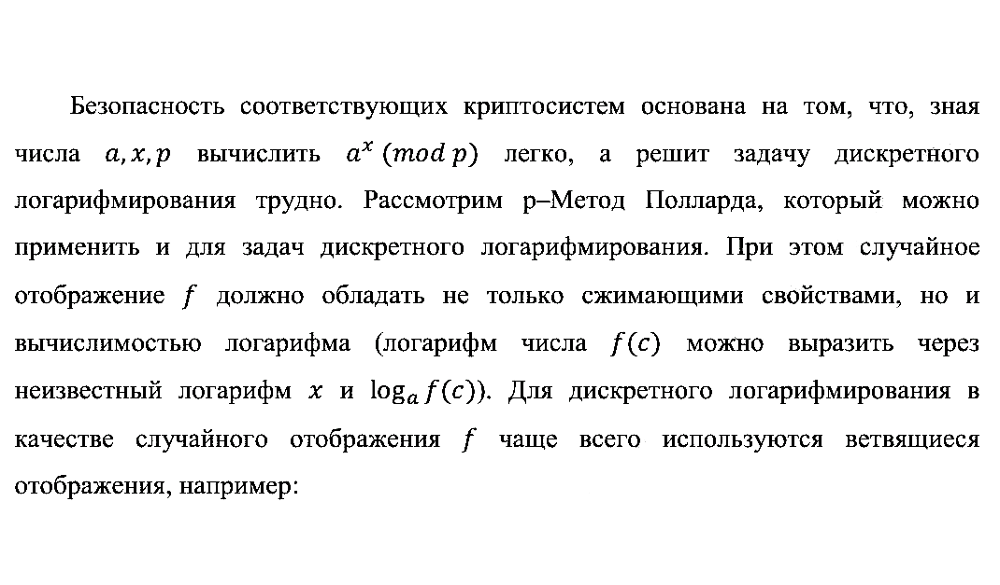
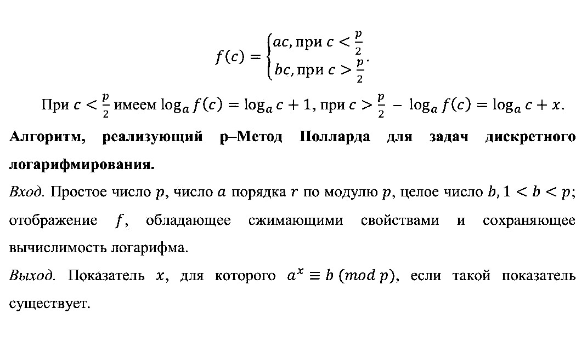
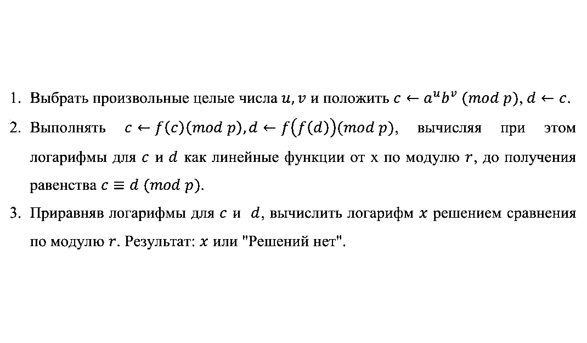
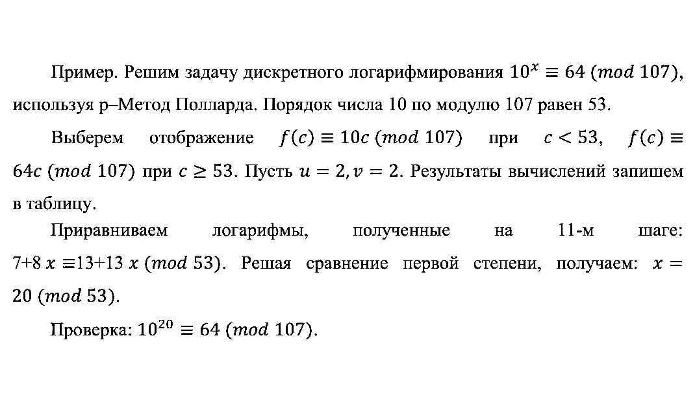
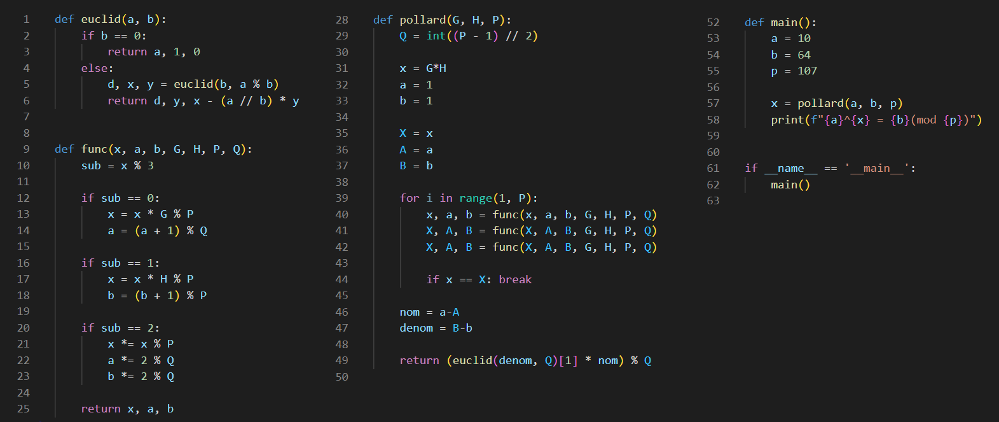

---
## Front matter
lang: ru-RU
title: "Лабораторная работа 7"
subtitle: "Дискретное логарифмирование в конечном поле" 
author: "Баранов Иван"
institute: RUDN University, Moscow, Russian Federation
date: 2022 Москва

## Formatting
mainfont: PT Serif
romanfont: PT Serif
sansfont: PT Serif
monofont: PT Serif
toc: false
slide_level: 2
theme: metropolis
header-includes: 
 - \metroset{progressbar=frametitle,sectionpage=progressbar,numbering=fraction}
 - '\makeatletter'
 - '\beamer@ignorenonframefalse'
 - '\makeatother'
aspectratio: 169
section-titles: true
---

# Цель работы 

## Цель работы

- Ознакомиться с задачей дискретного логарифмирования в конечном поле

- Рассмотреть теоретические основы представленного алгоритма

- Реализовать р-Метод Полларда для задач дискретного логарифмирования 

# Описание задачи

## Введение 

Задача дискретного логарифмирования, как и задача разложения на множители, применяется во многих алгоритмах криптографии с открытым ключом. 

Предложена в 1976 году У. Диффи и М. Хеллманом для установления сеансового ключа.

Эта задача послужила основой для создания протоколов шифрования и цифровой подписи, доказательств с нулевым разглашением и других криптографических протоколов.

## Условия кольца

{ #fig:001 width=90% }

## Свойства кольца

{ #fig:002 width=100% }

## Свойства отношения сравнимости

{ #fig:003 width=100% }

## Классы эквивалентности

{ #fig:004 width=100% }

## Постановка задачи

{ #fig:005 width=100% }

# р-Метод Полларда

## Отображение f()

{ #fig:006 width=100% }

## Описание алгоритма

{ #fig:007 width=100% }

## Последовательность вычислений

{ #fig:008 width=100% }

## Пример

{ #fig:009 width=100% }

# Реализация алгоритма

## Реализация алгоритма 

{ #fig:010 width=100% }

## Результат работы 

Результат работы данного алгоритма: 

$$
10^{20} = 64(mod 107)
$$

# Выводы

## Выводы

- Ознакомились с задачей дискретного логарифмирования в конечном поле

- Рассмотрели теоретические основы представленного алгоритма

- Реализовали р-Метод Полларда для задач дискретного логарифмирования 

## {.standout}

