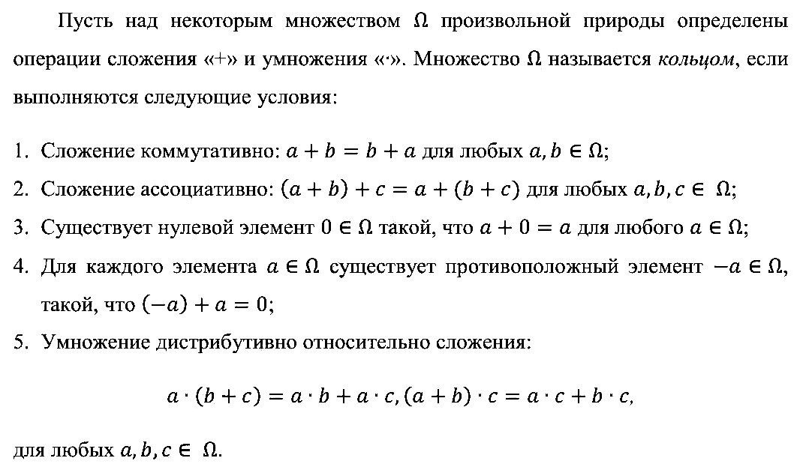
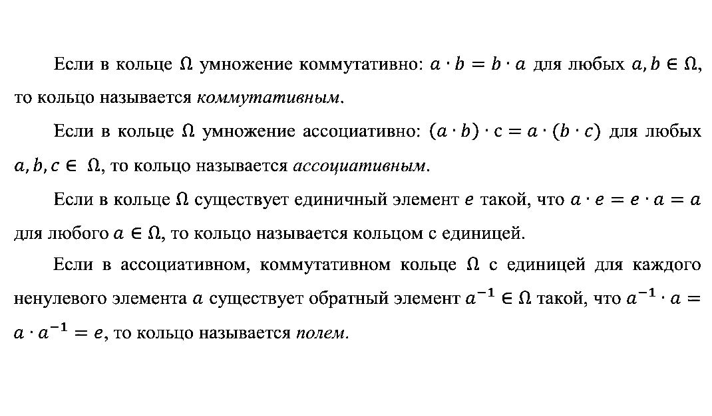
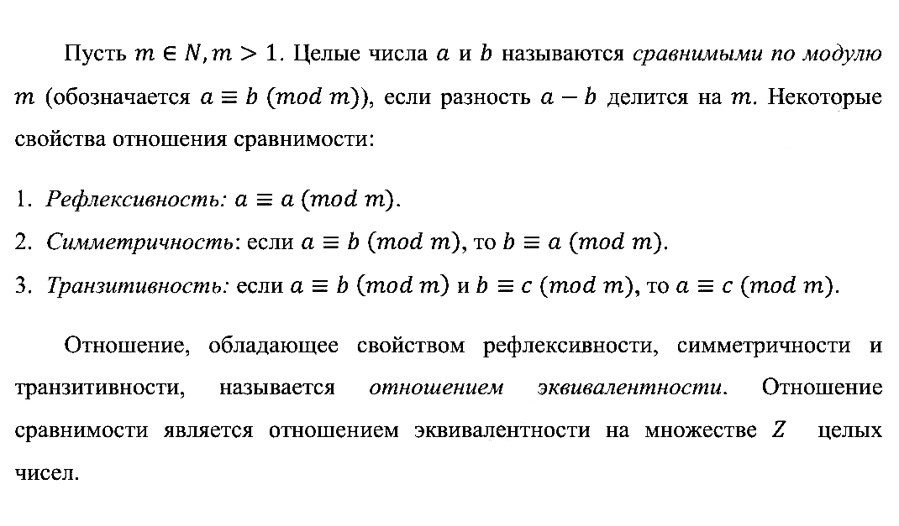
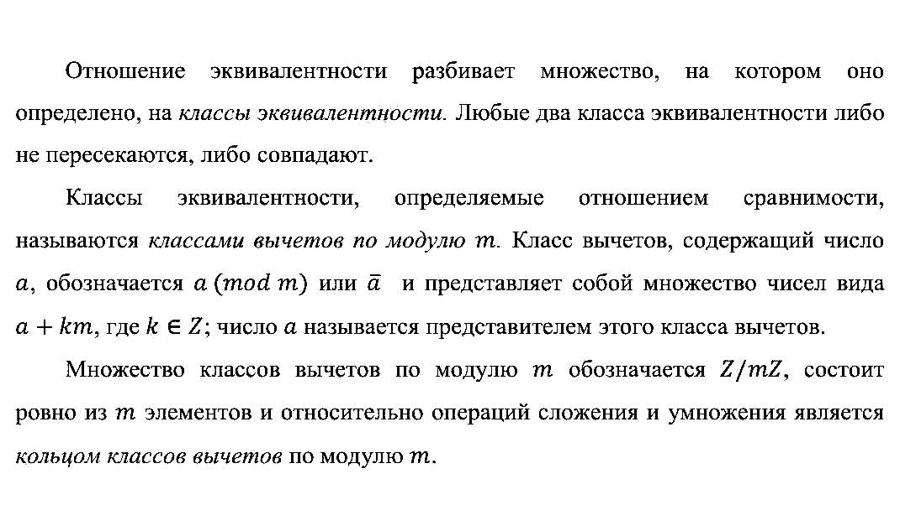
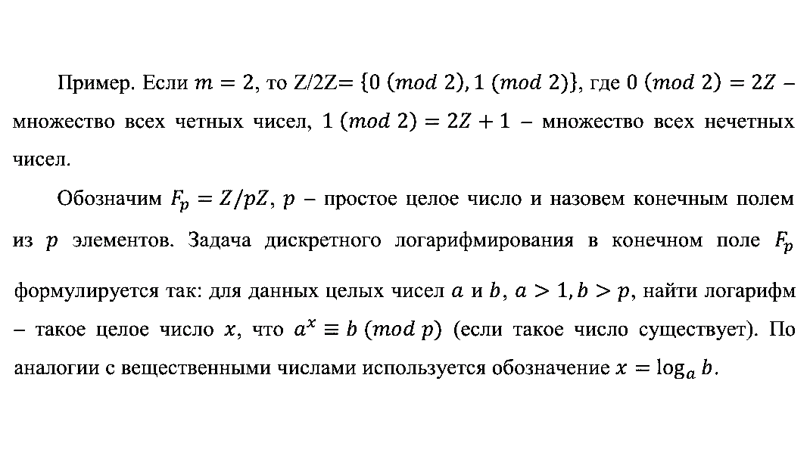
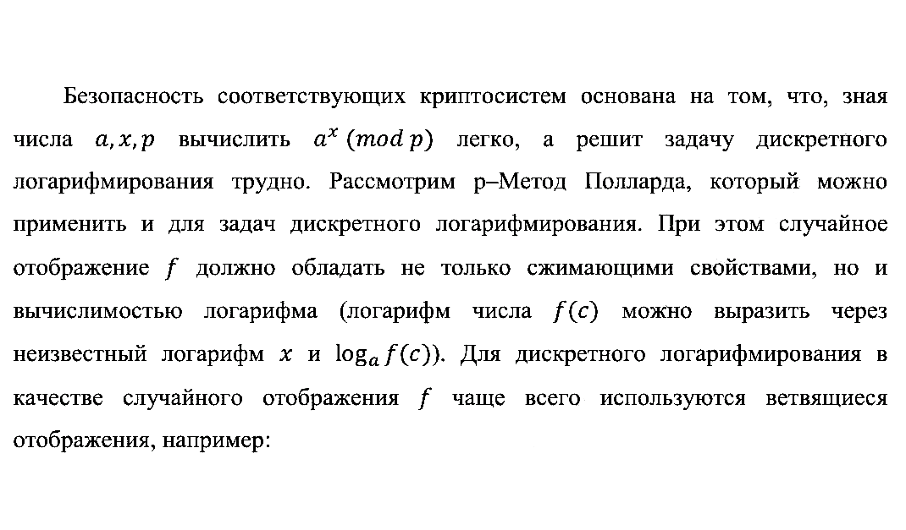
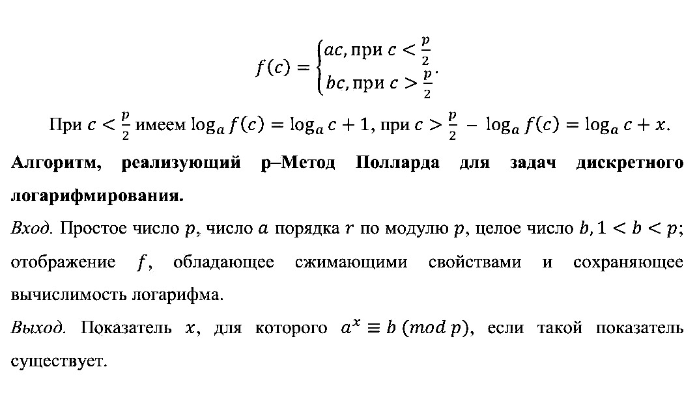
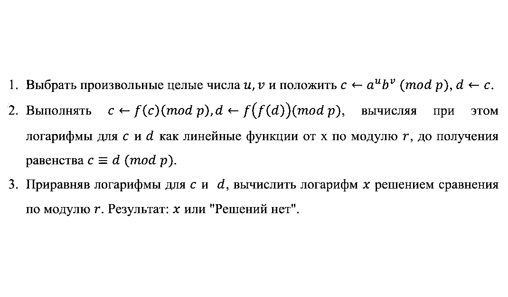
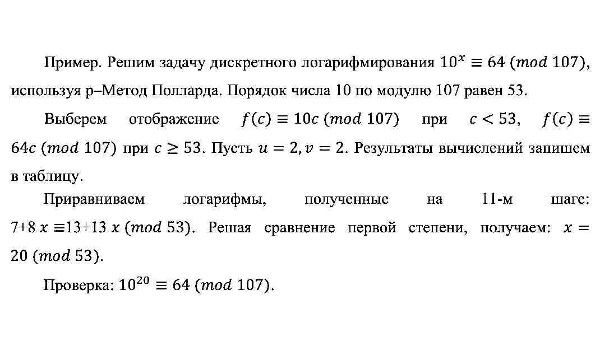
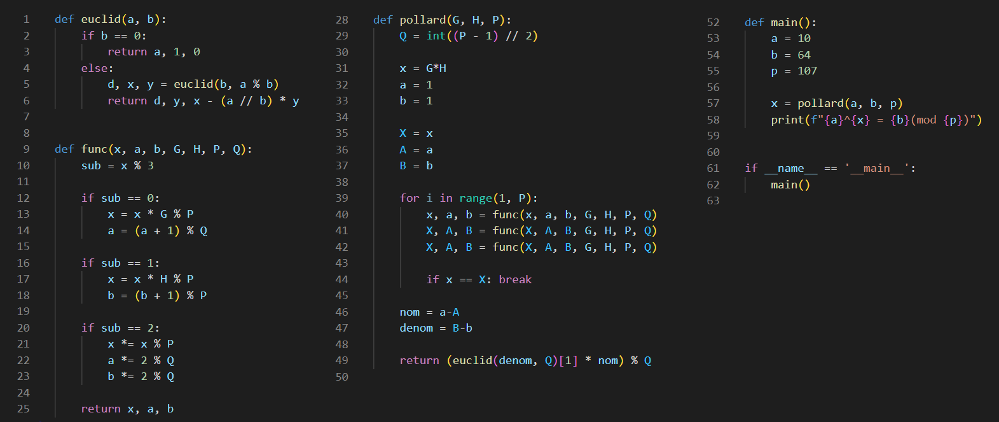

---
# Front matter
lang: ru-RU
title: "Лабораторная работа 7"
subtitle: "Дискретное логарифмирование в конечном поле" 
author: "Баранов Иван"

# Formatting
toc-title: "Содержание"
toc: true # Table of contents
toc_depth: 2
lof: true # List of figures
lot: false # List of tables
fontsize: 12pt
linestretch: 1.5
papersize: a4paper
documentclass: scrreprt
polyglossia-lang: russian
polyglossia-otherlangs: english
mainfont: PT Serif
romanfont: PT Serif
sansfont: PT Serif
monofont: PT Serif
mainfontoptions: Ligatures=TeX
romanfontoptions: Ligatures=TeX
sansfontoptions: Ligatures=TeX,Scale=MatchLowercase
monofontoptions: Scale=MatchLowercase
indent: true
pdf-engine: lualatex
header-includes:
  - \linepenalty=10 # the penalty added to the badness of each line within a paragraph (no associated penalty node) Increasing the value makes tex try to have fewer lines in the paragraph.
  - \interlinepenalty=0 # value of the penalty (node) added after each line of a paragraph.
  - \hyphenpenalty=50 # the penalty for line breaking at an automatically inserted hyphen
  - \exhyphenpenalty=50 # the penalty for line breaking at an explicit hyphen
  - \binoppenalty=700 # the penalty for breaking a line at a binary operator
  - \relpenalty=500 # the penalty for breaking a line at a relation
  - \clubpenalty=150 # extra penalty for breaking after first line of a paragraph
  - \widowpenalty=150 # extra penalty for breaking before last line of a paragraph
  - \displaywidowpenalty=50 # extra penalty for breaking before last line before a display math
  - \brokenpenalty=100 # extra penalty for page breaking after a hyphenated line
  - \predisplaypenalty=10000 # penalty for breaking before a display
  - \postdisplaypenalty=0 # penalty for breaking after a display
  - \floatingpenalty = 20000 # penalty for splitting an insertion (can only be split footnote in standard LaTeX)
  - \raggedbottom # or \flushbottom
  - \usepackage{float} # keep figures where there are in the text
  - \floatplacement{figure}{H} # keep figures where there are in the text
---


# Цель работы 

- Ознакомиться с задачей дискретного логарифмирования в конечном поле

- Рассмотреть теоретические основы представленного алгоритма

- Реализовать р-Метод Полларда для задач дискретного логарифмирования 

# Описание задачи

## Введение 

Задача дискретного логарифмирования, как и задача разложения на множители, применяется во многих алгоритмах криптографии с открытым ключом. 

Предложена в 1976 году У. Диффи и М. Хеллманом для установления сеансового ключа.

Эта задача послужила основой для создания протоколов шифрования и цифровой подписи, доказательств с нулевым разглашением и других криптографических протоколов.

## Условия кольца

{ #fig:001 width=90% }

## Свойства кольца

{ #fig:002 width=100% }

## Свойства отношения сравнимости

{ #fig:003 width=100% }

## Классы эквивалентности

{ #fig:004 width=100% }

## Постановка задачи

{ #fig:005 width=100% }

# р-Метод Полларда

## Отображение f()

{ #fig:006 width=100% }

## Описание алгоритма

{ #fig:007 width=100% }

## Последовательность вычислений

{ #fig:008 width=100% }

## Пример

{ #fig:009 width=100% }

# Реализация алгоритма

{ #fig:010 width=100% }

## Результат работы 

Результат работы данного алгоритма: 

$$
10^{20} = 64(mod 107)
$$

## Программный код

```
def euclid(a, b):
    if b == 0:
        return a, 1, 0
    else:
        d, x, y = euclid(b, a % b)
        return d, y, x - (a // b) * y


def func(x, a, b, G, H, P, Q):
    sub = x % 3

    if sub == 0:
        x = x * G % P
        a = (a + 1) % Q

    if sub == 1:
        x = x * H % P
        b = (b + 1) % P

    if sub == 2:
        x *= x % P
        a *= 2 % Q
        b *= 2 % Q

    return x, a, b


def pollard(G, H, P):
    Q = int((P - 1) // 2)

    x = G*H
    a = 1
    b = 1

    X = x
    A = a
    B = b

    for i in range(1, P):
        x, a, b = func(x, a, b, G, H, P, Q)
        X, A, B = func(X, A, B, G, H, P, Q)
        X, A, B = func(X, A, B, G, H, P, Q)

        if x == X: break

    nom = a-A
    denom = B-b

    return (euclid(denom, Q)[1] * nom) % Q


def main():
    a = 10
    b = 64
    p = 107

    x = pollard(a, b, p)
    print(f"{a}^{x} = {b}(mod {p})")


if __name__ == '__main__':
    main()

```

# Выводы

- Ознакомились с задачей дискретного логарифмирования в конечном поле

- Рассмотрели теоретические основы представленного алгоритма

- Реализовали р-Метод Полларда для задач дискретного логарифмирования 

